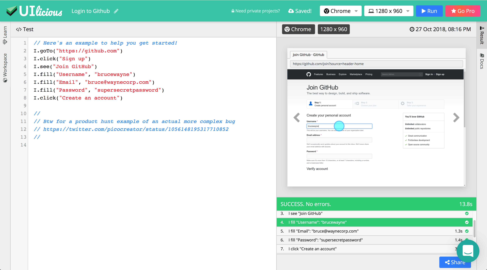

# UI-licious

[__Website__](https://uilicious.com) | [Docs](https://docs.uilicious.com/) | [Roadmap](https://trello.com/b/G80eoZU3) | [Change Log](https://docs.uilicious.com/release_notes.html) | [Contact Support](mailto:support@uilicious.com)

UI-licious is a tool to automate user journey testing for your website on different browsers and resolutions.



__Example__:

Here's an example to test the Github's Login flow

```javascript
I.goTo("https://github.com")
I.click("Sign up")
I.see("Join GitHub")
I.fill("Username", "brucewayne")
I.fill("Email", "bruce@waynecorp.com")
I.fill("Password", "supersecretpassword")
I.click("Create an account")
```

[▶️ Run this test](https://snippet.uilicious.com/test/public/XRYw8i91TTo9qtX4jgJUYm)

## How is it different from other testing libraries or tools?

__UI-licious is a high-level testing language, designed to be written and read by humans.__

Unlike other testing libraries or tools, which relies either hard-coding CSS and XPATH selectors into the tests *(or on the front-end developers writing The Perfect UI code)* UI-licious tests are designed to work regardless of how the UI is implemented.

UI-licious uses dynamic code analysis on your website to evaluate best matches for the target element of the given command based on the semantics of the HTML code and the context of preceding test commands. Your UI code doesn't not have to be perfect, but UI-licious works most accurately when the website uses semantic HTML and ARIA accessibily attributes. 

At best, you can write tests that are meaningful, robust, reusable, and easy to maintain. 
If not, UI-licious still support CSS and XPATH as a fallback.

## What front-end does UI-licious support?

React, Vue, Angular, Polymer, EmberJs, KnockoutJs, JQuery, Vanilla...

UI-licious works on any front-end! UI-licious works on good old static sites, server-sider rendered and modern SPA applications. 

Check out examples for: [React](https://uilicious.com/explore/react-framework.html) | [Vue](https://uilicious.com/explore/vue-framework.html) | [Angular](https://uilicious.com/explore/angular-framework.html) | [All](https://uilicious.com/explore)

## Supported browsers
- Chrome
- Firefox
- Safari
- Microsoft Edge
- Internet Explorer 11


## Installation

There's none! 

Head over here to start testing your application: [https://snippet.uilicious.com](https://snippet.uilicious.com)

## Get Started

You can start with the tutorial on [https://snippet.uilicious.com](https://snippet.uilicious.com), or [Read the Docs](https://docs.uilicious.com).

[List of commands](https://docs.uilicious.com/scripting/list_of_commands.html)

## What's UI-licious Studio?

UI-licious Studio is the professional edition of UI-licious, with advanced features such as:
- __Projects__ to organise and manage tests and reports
- __Datasets__ to manage sensitive test data and quickly swap test data between tests
- __Jobs__ to schedule tests and setup error alerts

[View plans and pricing](https://uilicious.com/pricing.html)

## Command Line Interface

> You need to have a UI-licious Studio account to use the Command Line Interface

You can execute UI-licious tests using the CLI. This allows you hook tests into your deployment build within your CI/CD tools.

[Read the Docs](https://github.com/uilicious/uilicious-cli)


